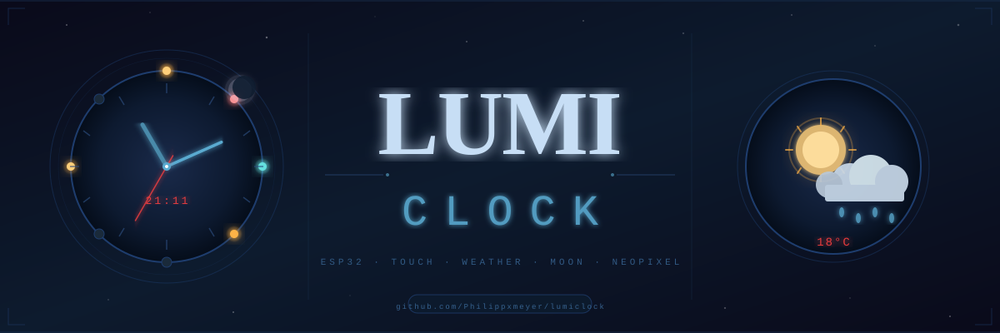

# Lumiclock

> Eine Kinderuhr auf ESP32-Basis mit Wetter, Mondphase, Touch-Bedienung, Nachtlicht und OTA-Updates – also genau das, was man baut, wenn ein normaler Wecker einfach **zu wenig Overengineering** hat.

## Was ist das?

**Lumiclock** ist ein Arduino/ESP32-Projekt für ein 3.5" TFT-Display (480×320), das drei Hauptansichten bietet:

1. **Uhrzeit + Datum**
2. **Wetter** (über Open-Meteo, ohne API-Key)
3. **Mondphase** (lokal berechnet)

Gesteuert wird das Ganze über **kapazitive Touch-Pads** (T6/T7/T8). Zusätzlich gibt’s einen **NeoPixel-Ring** als Nachtlicht und **OTA-Updates**, damit du Firmware nicht jedes Mal per Kabel einspielen musst wie im Mittelalter von 2014.

---

## Features (aka „Warum das Teil cool ist“)

- **Große, gut lesbare Uhrzeitanzeige** mit Datum auf Deutsch.
- **Wetterdaten in Echtzeit** (Temperatur, gefühlte Temperatur, Wetterzustand + Icon).
- **Mondphasenanzeige** inkl. Namen und Mondalter.
- **Touch-UI mit Entprellung und Fehltrigger-Schutz**.
- **Nachtmodus** (Display-Hintergrundlicht aus, sanftes Ringlicht an).
- **Automatischer Rücksprung zur Uhranzeige** nach Timeout.
- **OTA-Firmwareupdates** über WLAN.
- **LittleFS-Assets** (PNG-Icons für Wetter und Mondphasen).

---

## Hardware-Annahmen

Das Projekt geht (laut Code) von folgender Verdrahtung aus:

- **ESP32**
- **TFT 480×320** mit `TFT_eSPI`
- **TFT Backlight Pin**: GPIO **4**
- **NeoPixel Ring (WS2812)**:
  - Data Pin: GPIO **12**
  - LEDs: **8**
- **Touch-Eingänge**:
  - Uhr: **T6**
  - Wetter: **T7**
  - Mond: **T8**

Wenn deine Pins anders sind: keine Panik, nur Header anpassen. (Ja, man muss manchmal tatsächlich Code ändern.)

---

## Software-Architektur

Das Projekt ist modular in Header-Dateien aufgeteilt:

- `lumiclock.ino` – Setup/Loop, Display-Rendering-Flow, Nachtmodus, PNG-Decoder-Callbacks
- `lumiclock_state.h` – State Machine (`STATE_CLOCK`, `STATE_WEATHER`, `STATE_MOON`)
- `touch_control.h` – Touch-Interrupts, Debounce, Backlight-Wakeup-Logik
- `display_time.h` – Uhrzeit/Datum rendern
- `weather.h` – Wetterabruf via HTTPS + JSON Parsing + Rendering
- `moon_phase.h` – Mondphasenberechnung + Rendering
- `ring_light.h` – NeoPixel-Ringsteuerung/Nachtlicht
- `ntp_client.h` – NTP + Zeitzonenhandling (inkl. Sommerzeit)
- `ota_update.h` – ArduinoOTA Integration

Kurz gesagt: **eine kleine Embedded-App mit sauberer Zustandslogik statt 800 Zeilen im `loop()`-Kessel**.

---

## Zustände & Bedienung

### Zustände

- `STATE_CLOCK`: Standardansicht
- `STATE_WEATHER`: Wetteransicht
- `STATE_MOON`: Mondansicht

Nicht-Uhrzustände springen nach `STATE_TIMEOUT_MS` (10 Sekunden) automatisch zurück auf die Uhr.

### Touch-Verhalten

- Touch löst Interrupt aus.
- Danach wird die Berührung doppelt geprüft (`touchRead()` zweimal mit kurzem Abstand), um Fehlauslösungen zu reduzieren.
- Zusätzliche Schutzmechanismen:
  - Boot-Guard (`TOUCH_BOOT_GUARD_MS`)
  - Debounce (`TOUCH_DEBOUNCE_MS`)

Ja, kapazitiver Touch kann zickig sein. Nein, du bist damit nicht allein.

---

## Wetterdaten

- Quelle: **Open-Meteo**
- Abfrageintervall: **alle 30 Minuten**
- Verbindung: HTTPS via `WiFiClientSecure`
- Hinweis: `setInsecure()` ist aktiv (Zertifikatsprüfung deaktiviert)

Das ist für ein Hobby-/Hausgerät oft okay, sicherheitstechnisch aber nicht „Enterprise-grade Zero-Trust Space Station Security™“. Wer’s härter will: Root-CA pinnen.

### Standort

In `weather.h` aktuell gesetzt auf:

- Latitude: `50.735`
- Longitude: `7.967`
- Zeitzone für API: `Europe/Berlin`

Bitte auf deinen Standort anpassen, außer du wohnst zufällig exakt da.

---

## Zeit & Zeitzone

NTP läuft über `pool.ntp.org`.

Zeitzone ist als POSIX-String gesetzt:

`CET-1CEST,M3.5.0,M10.5.0/3`

Das bedeutet automatische Sommer-/Winterzeitumschaltung für Mitteleuropa. Weil wir 2026 sind und man sowas nicht mehr manuell „if Monat > 3“ hacken sollte.

---

## Nachtmodus

Zwischen **19:00 und 07:00**:

- TFT-Backlight aus (sofern nicht gerade durch Touch aktiv)
- Ringlicht im sehr dunklen Warmweiß-Modus an

Touch kann das Backlight temporär wieder aktivieren, danach greift ein Timeout.

---

## OTA-Updates

ArduinoOTA ist integriert:

- Hostname: `lumiclock`
- Passwort: `lumiclock-ota`

Beim OTA-Update zeigt das Display einen Fortschrittsbalken. Weil Fortschrittsbalken alles professioneller wirken lassen.

⚠️ **Wichtig:** Passwort vor produktivem Einsatz ändern.

---

## Dateisystem / Assets

Das Projekt erwartet PNG-Dateien im LittleFS (aus dem Ordner `data/`), u. a.:

- Wetter-Icons: `01-s.png` bis `44-s.png` (je nach Mapping)
- Mondphasen: `moon0.png` bis `moon7.png`

Beim Start wird ein kleiner Asset-Healthcheck geloggt. Fehlende Dateien führen nicht zu Weltuntergang, aber zu kaputten Anzeigen – was in der Praxis fast genauso nervig ist.

---

## Installation (kurz & ehrlich)

1. **Arduino IDE** oder PlatformIO mit ESP32-Toolchain vorbereiten.
2. Benötigte Libraries installieren (u. a. `TFT_eSPI`, `PNGdec`, `ArduinoJson`, `Adafruit_NeoPixel`, `ArduinoOTA`).
3. Datei `wifi_credentials.h` anlegen (oder aus Vorlage übernehmen), mit:
   - `WIFI_SSID`
   - `WIFI_PASSWORD`
   - `connectToWiFi()`
4. `TFT_eSPI` auf dein Display konfigurieren.
5. Inhalte von `data/` als LittleFS-Image auf den ESP32 laden.
6. Sketch flashen.

Wenn Schritt 5 fehlt, wirst du sehr kreativ gestaltete schwarze Flächen sehen.

---

## Bekannte Besonderheiten

- Einige Header nutzen Fonts wie `FreeSans18pt7b`; je nach Setup muss der Font in deiner Umgebung verfügbar/eingebunden sein.
- Wetterdaten werden zwischengespeichert; ohne WLAN bleibt der letzte gültige Stand erhalten bzw. es erscheint „Keine Wetterdaten“.
- Das Projekt ist stark auf den aktuellen Display-/Layout-Usecase zugeschnitten – also absichtlich pragmatisch statt generisch.

---

## Lizenz

Siehe `LICENSE`.

---

## Warum dieser README so klingt

Weil Embedded-Entwicklung eine Mischung aus Ingenieurskunst, Geduld und „Warum geht der Touch nur bei Vollmond?“ ist.  
Und Lumiclock hat jetzt immerhin den Teil mit dem Vollmond bereits integriert.
